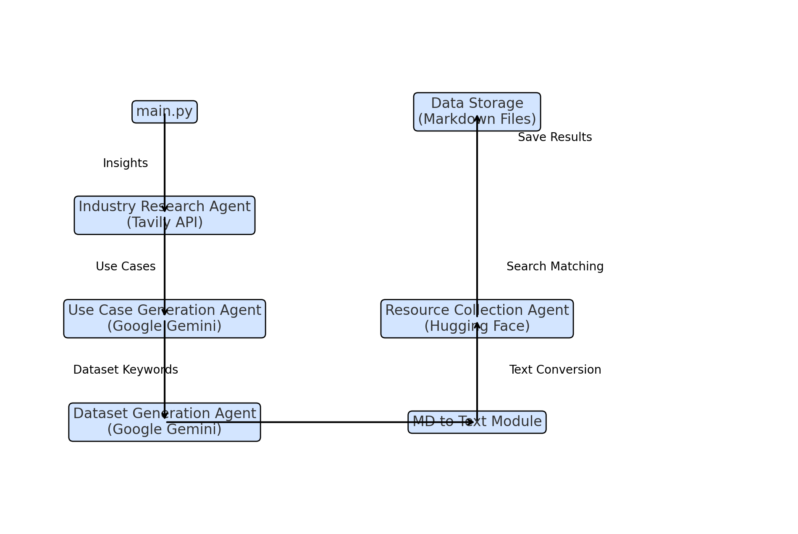

# Healthcare AI Project

## Overview

This project implements a Multi-Agent system to generate AI use cases for the healthcare industry. It performs industry research, generates relevant use cases, and collects datasets from `Huggingface`.

## Project Structure

- `agents/`: Contains the individual agent implementations.
- `data/`: Stores the output use cases and resource links.
- `main.py`: Main script to execute the agents.
- `requirements.txt`: Dependencies for the project.

## Setup

1. Download the `ZIP file` of Project and **OPEN** it in `vscode` or any editor.
2. Navigate to `Project Directory` and open **terminal** or **cmd**.
3. Install the required packages:
   ```bash
   pip install -r requirements.txt
   ```
4. Create a `.env` file in the root of your project and add your API keys:

   ```bash
   GEMINI_API_KEY=your_gemini_api_key_here
   TAVILYCLIENT_API_KEY=your_tavilyclient_api_key_here
   HUGGINGFACE_TOKEN=your_huggingface_token_here
   ```

5. Run the main script:
   ```bash
   python main.py
   ```

## Output

The use cases and resource links and all other results will be stored in the `data/` directory after generated.

`Demo Video is available in project. Download to see it.`

## Flowchart

Here's the architecture flowchart illustrating your project's agent interactions and data flow. Each component is represented by a box, with arrows showing the sequence and flow of information between agents:

1. **main.py** initiates the flow by calling each agent.
2. **Industry Research Agent** gathers insights via the Tavily API.
3. **Use Case Generation Agent** generates use cases from these insights with Google Gemini.
4. **Dataset Generation Agent** creates keywords based on use cases for dataset retrieval.
5. **MD to Text Module** converts dataset suggestions from Markdown format to text.
6. **Resource Collection Agent** searches Hugging Face datasets using fuzzy matching.
7. **Data Storage** saves outputs into structured Markdown files.



## Report
To read report [Click Here](PROJECT_REPORT.md)